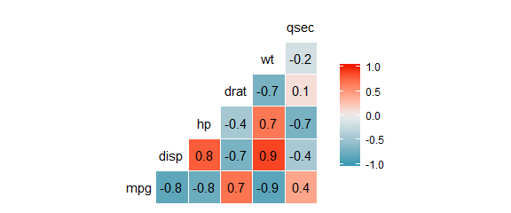
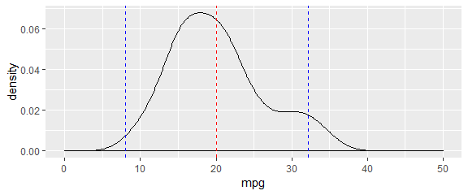
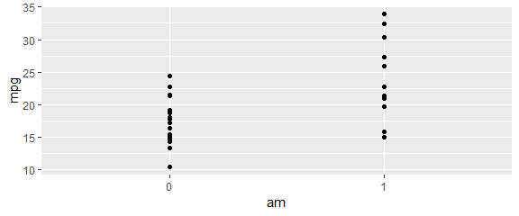
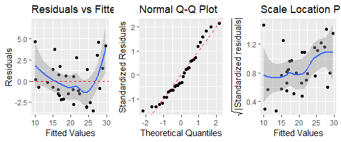

## Executive Summary
We are going to investigate MPG for various vehicles using the mtcars dataset. 
We would like to know how the variables affect MPG, and in particular, we want 
to investigate the relationship between MPG and transmission. We are tasked with
answering the following questions:

1) Is manual or automatic transmission better for MPG?
2) Can we quantify the MPG difference between automatic and manual transmission?

To answer these questions we will use both simple linear regression and also a 
multivariate linear regression to model the relationship. Since there are 
several variables we could include in many different linear models we could fit,
we will use a backwards elimination method to attempt to find the best fitting 
linear regression model for our given data.

## Exploratory analysis
We'll start by taking a look at the data and doing some exploratory analysis. 
We first will load the mtcars data and take a look at the first few rows. 
Then we'll peek at the structure and get a quick summary of the data. For more 
information about the data we can look at the help file.


```
##                    mpg cyl disp  hp drat    wt  qsec vs am gear carb
## Mazda RX4         21.0   6  160 110 3.90 2.620 16.46  0  1    4    4
## Mazda RX4 Wag     21.0   6  160 110 3.90 2.875 17.02  0  1    4    4
## Datsun 710        22.8   4  108  93 3.85 2.320 18.61  1  1    4    1
## Hornet 4 Drive    21.4   6  258 110 3.08 3.215 19.44  1  0    3    1
## Hornet Sportabout 18.7   8  360 175 3.15 3.440 17.02  0  0    3    2
## Valiant           18.1   6  225 105 2.76 3.460 20.22  1  0    3    1
```

```
## 'data.frame':	32 obs. of  11 variables:
##  $ mpg : num  21 21 22.8 21.4 18.7 18.1 14.3 24.4 22.8 19.2 ...
##  $ cyl : num  6 6 4 6 8 6 8 4 4 6 ...
##  $ disp: num  160 160 108 258 360 ...
##  $ hp  : num  110 110 93 110 175 105 245 62 95 123 ...
##  $ drat: num  3.9 3.9 3.85 3.08 3.15 2.76 3.21 3.69 3.92 3.92 ...
##  $ wt  : num  2.62 2.88 2.32 3.21 3.44 ...
##  $ qsec: num  16.5 17 18.6 19.4 17 ...
##  $ vs  : num  0 0 1 1 0 1 0 1 1 1 ...
##  $ am  : num  1 1 1 0 0 0 0 0 0 0 ...
##  $ gear: num  4 4 4 3 3 3 3 4 4 4 ...
##  $ carb: num  4 4 1 1 2 1 4 2 2 4 ...
```

```
##       mpg             cyl             disp             hp       
##  Min.   :10.40   Min.   :4.000   Min.   : 71.1   Min.   : 52.0  
##  1st Qu.:15.43   1st Qu.:4.000   1st Qu.:120.8   1st Qu.: 96.5  
##  Median :19.20   Median :6.000   Median :196.3   Median :123.0  
##  Mean   :20.09   Mean   :6.188   Mean   :230.7   Mean   :146.7  
##  3rd Qu.:22.80   3rd Qu.:8.000   3rd Qu.:326.0   3rd Qu.:180.0  
##  Max.   :33.90   Max.   :8.000   Max.   :472.0   Max.   :335.0  
##       drat             wt             qsec             vs        
##  Min.   :2.760   Min.   :1.513   Min.   :14.50   Min.   :0.0000  
##  1st Qu.:3.080   1st Qu.:2.581   1st Qu.:16.89   1st Qu.:0.0000  
##  Median :3.695   Median :3.325   Median :17.71   Median :0.0000  
##  Mean   :3.597   Mean   :3.217   Mean   :17.85   Mean   :0.4375  
##  3rd Qu.:3.920   3rd Qu.:3.610   3rd Qu.:18.90   3rd Qu.:1.0000  
##  Max.   :4.930   Max.   :5.424   Max.   :22.90   Max.   :1.0000  
##        am              gear            carb      
##  Min.   :0.0000   Min.   :3.000   Min.   :1.000  
##  1st Qu.:0.0000   1st Qu.:3.000   1st Qu.:2.000  
##  Median :0.0000   Median :4.000   Median :2.000  
##  Mean   :0.4062   Mean   :3.688   Mean   :2.812  
##  3rd Qu.:1.0000   3rd Qu.:4.000   3rd Qu.:4.000  
##  Max.   :1.0000   Max.   :5.000   Max.   :8.000
```

It seems **am** and **vs** are binary factor variables, and **cyl**, **gear**, & **carb** are multi-
level factor variables, since they can only take integer values they are not 
continuous. However for simplicity we will treat them as continuous variables 
in our model. We'll convert the desired variables into factor variables.


```
## 'data.frame':	32 obs. of  11 variables:
##  $ mpg : num  21 21 22.8 21.4 18.7 18.1 14.3 24.4 22.8 19.2 ...
##  $ cyl : num  6 6 4 6 8 6 8 4 4 6 ...
##  $ disp: num  160 160 108 258 360 ...
##  $ hp  : num  110 110 93 110 175 105 245 62 95 123 ...
##  $ drat: num  3.9 3.9 3.85 3.08 3.15 2.76 3.21 3.69 3.92 3.92 ...
##  $ wt  : num  2.62 2.88 2.32 3.21 3.44 ...
##  $ qsec: num  16.5 17 18.6 19.4 17 ...
##  $ vs  : Factor w/ 2 levels "0","1": 1 1 2 2 1 2 1 2 2 2 ...
##  $ am  : Factor w/ 2 levels "0","1": 2 2 2 1 1 1 1 1 1 1 ...
##  $ gear: num  4 4 4 3 3 3 3 4 4 4 ...
##  $ carb: num  4 4 1 1 2 1 4 2 2 4 ...
```

We'll explore the data a bit further to help inform our modeling process. First 
let's see how the variables in **mtcars** are correlated to each other.

<!-- -->

It seems many of the variables show strong correlation to the other variables, 
so it is likely not all of them will be used in the final model, otherwise we 
might have overfitting.

Let's check to see how the **mpg** data are distributed. We'll plot the density 
along with a red line for the mean and blue lines representing the 95% confidence
intervals.

<!-- -->

Looks like the data may not be normally distributed. It appears slightly skewed
and it might be tail heavy. This could throw off our model a bit, but for now 
we'll continue.

## Inference & Hypothesis Testing

Now we'll plot **mpg** vs **am** to visualize how the two are related, and then
look the mean mpg for cars with manual and automatic transmissions.

<!-- -->

```
## # A tibble: 2 x 2
##   am     mean
##   <fct> <dbl>
## 1 0      17.1
## 2 1      24.4
```

So it looks like there's a difference in average mpg for automatic and manual 
transmission cars. Cars with automatic transmission have an average mpg of 17.1
and those with manual transmission have an average mpg of 24.4

However the two groups do not appear to have the same variance, so let's keep 
this in mind while running a hypothesis test to see if this difference may be
statistically significant. We'll perform a two group T-test and we will choose 
our alpha to be 0.05.


```
## 
## 	Welch Two Sample t-test
## 
## data:  mpg by am
## t = -3.7671, df = 18.332, p-value = 0.001374
## alternative hypothesis: true difference in means is not equal to 0
## 95 percent confidence interval:
##  -11.280194  -3.209684
## sample estimates:
## mean in group 0 mean in group 1 
##        17.14737        24.39231
```

So it seems manual transmission is associated with an increase in mpg of 7.25, 
and this is significant with a p-value of 0.001374.

## Model Selection
We'll start by looking at the simple linear model regressing **mpg** on **am** alone


```
##              Estimate Std. Error   t value     Pr(>|t|)
## (Intercept) 17.147368   1.124603 15.247492 1.133983e-15
## am1          7.244939   1.764422  4.106127 2.850207e-04
```

This confirms our previous analysis, here the coefficient labeled 'intercept' 
represents the mean mpg for automatic transmission cars, and the coefficient 
'am1' represents the change in mean for cars with manual transmission. It appears
to be an increase of about 7.25, like we saw before. The p-value here is different
because by default, R's 'lm' function uses a test assuming equal variance in the
two groups.

Now let's look at the multivariate regression model using all the variables.

```
## 
## Call:
## lm(formula = mpg ~ ., data = mtcars)
## 
## Residuals:
##     Min      1Q  Median      3Q     Max 
## -3.4506 -1.6044 -0.1196  1.2193  4.6271 
## 
## Coefficients:
##             Estimate Std. Error t value Pr(>|t|)  
## (Intercept) 12.30337   18.71788   0.657   0.5181  
## cyl         -0.11144    1.04502  -0.107   0.9161  
## disp         0.01334    0.01786   0.747   0.4635  
## hp          -0.02148    0.02177  -0.987   0.3350  
## drat         0.78711    1.63537   0.481   0.6353  
## wt          -3.71530    1.89441  -1.961   0.0633 .
## qsec         0.82104    0.73084   1.123   0.2739  
## vs1          0.31776    2.10451   0.151   0.8814  
## am1          2.52023    2.05665   1.225   0.2340  
## gear         0.65541    1.49326   0.439   0.6652  
## carb        -0.19942    0.82875  -0.241   0.8122  
## ---
## Signif. codes:  0 '***' 0.001 '**' 0.01 '*' 0.05 '.' 0.1 ' ' 1
## 
## Residual standard error: 2.65 on 21 degrees of freedom
## Multiple R-squared:  0.869,	Adjusted R-squared:  0.8066 
## F-statistic: 13.93 on 10 and 21 DF,  p-value: 3.793e-07
```

The change in mpg no longer appears to be significant, but our model is likely 
not the best considering how much correlation we saw among the regressors earlier.
We will use a step-wise backwards elimination method to remove regressors one-by-one
until we have something that better models our data. We'll look at all the 
variable's coefficients and choose the one with the highest p-value to eliminate
from our next model. We will repeat this process until all our coefficients are 
significant.


```
## 
## Call:
## lm(formula = mpg ~ . - cyl, data = mtcars)
## 
## Residuals:
##     Min      1Q  Median      3Q     Max 
## -3.4286 -1.5908 -0.0412  1.2120  4.5961 
## 
## Coefficients:
##             Estimate Std. Error t value Pr(>|t|)  
## (Intercept) 10.96007   13.53030   0.810   0.4266  
## disp         0.01283    0.01682   0.763   0.4538  
## hp          -0.02191    0.02091  -1.048   0.3062  
## drat         0.83520    1.53625   0.544   0.5921  
## wt          -3.69251    1.83954  -2.007   0.0572 .
## qsec         0.84244    0.68678   1.227   0.2329  
## vs1          0.38975    1.94800   0.200   0.8433  
## am1          2.57743    1.94035   1.328   0.1977  
## gear         0.71155    1.36562   0.521   0.6075  
## carb        -0.21958    0.78856  -0.278   0.7833  
## ---
## Signif. codes:  0 '***' 0.001 '**' 0.01 '*' 0.05 '.' 0.1 ' ' 1
## 
## Residual standard error: 2.59 on 22 degrees of freedom
## Multiple R-squared:  0.8689,	Adjusted R-squared:  0.8153 
## F-statistic: 16.21 on 9 and 22 DF,  p-value: 9.031e-08
```

```
## 
## Call:
## lm(formula = mpg ~ . - cyl - vs, data = mtcars)
## 
## Residuals:
##    Min     1Q Median     3Q    Max 
## -3.356 -1.576 -0.149  1.218  4.604 
## 
## Coefficients:
##             Estimate Std. Error t value Pr(>|t|)  
## (Intercept)  9.76828   11.89230   0.821   0.4199  
## disp         0.01214    0.01612   0.753   0.4590  
## hp          -0.02095    0.01993  -1.051   0.3040  
## drat         0.87510    1.49113   0.587   0.5630  
## wt          -3.71151    1.79834  -2.064   0.0505 .
## qsec         0.91083    0.58312   1.562   0.1319  
## am1          2.52390    1.88128   1.342   0.1928  
## gear         0.75984    1.31577   0.577   0.5692  
## carb        -0.24796    0.75933  -0.327   0.7470  
## ---
## Signif. codes:  0 '***' 0.001 '**' 0.01 '*' 0.05 '.' 0.1 ' ' 1
## 
## Residual standard error: 2.535 on 23 degrees of freedom
## Multiple R-squared:  0.8687,	Adjusted R-squared:  0.823 
## F-statistic: 19.02 on 8 and 23 DF,  p-value: 2.008e-08
```

```
## 
## Call:
## lm(formula = mpg ~ . - cyl - vs - carb, data = mtcars)
## 
## Residuals:
##     Min      1Q  Median      3Q     Max 
## -3.1200 -1.7753 -0.1446  1.0903  4.7172 
## 
## Coefficients:
##             Estimate Std. Error t value Pr(>|t|)   
## (Intercept)  9.19763   11.54220   0.797  0.43334   
## disp         0.01552    0.01214   1.278  0.21342   
## hp          -0.02471    0.01596  -1.548  0.13476   
## drat         0.81023    1.45007   0.559  0.58151   
## wt          -4.13065    1.23593  -3.342  0.00272 **
## qsec         1.00979    0.48883   2.066  0.04981 * 
## am1          2.58980    1.83528   1.411  0.17104   
## gear         0.60644    1.20596   0.503  0.61964   
## ---
## Signif. codes:  0 '***' 0.001 '**' 0.01 '*' 0.05 '.' 0.1 ' ' 1
## 
## Residual standard error: 2.488 on 24 degrees of freedom
## Multiple R-squared:  0.8681,	Adjusted R-squared:  0.8296 
## F-statistic: 22.56 on 7 and 24 DF,  p-value: 4.218e-09
```

```
## 
## Call:
## lm(formula = mpg ~ . - cyl - vs - carb - gear, data = mtcars)
## 
## Residuals:
##     Min      1Q  Median      3Q     Max 
## -3.2669 -1.6148 -0.2585  1.1220  4.5564 
## 
## Coefficients:
##             Estimate Std. Error t value Pr(>|t|)   
## (Intercept) 10.71062   10.97539   0.976  0.33848   
## disp         0.01310    0.01098   1.193  0.24405   
## hp          -0.02180    0.01465  -1.488  0.14938   
## drat         1.02065    1.36748   0.746  0.46240   
## wt          -4.04454    1.20558  -3.355  0.00254 **
## qsec         0.99073    0.48002   2.064  0.04955 * 
## am1          2.98469    1.63382   1.827  0.07969 . 
## ---
## Signif. codes:  0 '***' 0.001 '**' 0.01 '*' 0.05 '.' 0.1 ' ' 1
## 
## Residual standard error: 2.45 on 25 degrees of freedom
## Multiple R-squared:  0.8667,	Adjusted R-squared:  0.8347 
## F-statistic: 27.09 on 6 and 25 DF,  p-value: 8.637e-10
```

```
## 
## Call:
## lm(formula = mpg ~ . - cyl - vs - carb - gear - drat, data = mtcars)
## 
## Residuals:
##     Min      1Q  Median      3Q     Max 
## -3.5399 -1.7398 -0.3196  1.1676  4.5534 
## 
## Coefficients:
##             Estimate Std. Error t value Pr(>|t|)   
## (Intercept) 14.36190    9.74079   1.474  0.15238   
## disp         0.01124    0.01060   1.060  0.29897   
## hp          -0.02117    0.01450  -1.460  0.15639   
## wt          -4.08433    1.19410  -3.420  0.00208 **
## qsec         1.00690    0.47543   2.118  0.04391 * 
## am1          3.47045    1.48578   2.336  0.02749 * 
## ---
## Signif. codes:  0 '***' 0.001 '**' 0.01 '*' 0.05 '.' 0.1 ' ' 1
## 
## Residual standard error: 2.429 on 26 degrees of freedom
## Multiple R-squared:  0.8637,	Adjusted R-squared:  0.8375 
## F-statistic: 32.96 on 5 and 26 DF,  p-value: 1.844e-10
```

```
## 
## Call:
## lm(formula = mpg ~ . - cyl - vs - carb - gear - drat - disp, 
##     data = mtcars)
## 
## Residuals:
##     Min      1Q  Median      3Q     Max 
## -3.4975 -1.5902 -0.1122  1.1795  4.5404 
## 
## Coefficients:
##             Estimate Std. Error t value Pr(>|t|)   
## (Intercept) 17.44019    9.31887   1.871  0.07215 . 
## hp          -0.01765    0.01415  -1.247  0.22309   
## wt          -3.23810    0.88990  -3.639  0.00114 **
## qsec         0.81060    0.43887   1.847  0.07573 . 
## am1          2.92550    1.39715   2.094  0.04579 * 
## ---
## Signif. codes:  0 '***' 0.001 '**' 0.01 '*' 0.05 '.' 0.1 ' ' 1
## 
## Residual standard error: 2.435 on 27 degrees of freedom
## Multiple R-squared:  0.8579,	Adjusted R-squared:  0.8368 
## F-statistic: 40.74 on 4 and 27 DF,  p-value: 4.589e-11
```

```
## 
## Call:
## lm(formula = mpg ~ . - cyl - vs - carb - gear - drat - disp - 
##     hp, data = mtcars)
## 
## Residuals:
##     Min      1Q  Median      3Q     Max 
## -3.4811 -1.5555 -0.7257  1.4110  4.6610 
## 
## Coefficients:
##             Estimate Std. Error t value Pr(>|t|)    
## (Intercept)   9.6178     6.9596   1.382 0.177915    
## wt           -3.9165     0.7112  -5.507 6.95e-06 ***
## qsec          1.2259     0.2887   4.247 0.000216 ***
## am1           2.9358     1.4109   2.081 0.046716 *  
## ---
## Signif. codes:  0 '***' 0.001 '**' 0.01 '*' 0.05 '.' 0.1 ' ' 1
## 
## Residual standard error: 2.459 on 28 degrees of freedom
## Multiple R-squared:  0.8497,	Adjusted R-squared:  0.8336 
## F-statistic: 52.75 on 3 and 28 DF,  p-value: 1.21e-11
```

We can see that the backwards elmination method produces a model which regresses
**mpg** on **am**, **wt**, and **qsec**. But it seems that the R^2 value actually
decreased after in our final two models, so let's do some more analysis to make 
sure we have good model fit.


```
## Analysis of Variance Table
## 
## Model 1: mpg ~ am + wt + qsec
## Model 2: mpg ~ am + wt + qsec + hp
## Model 3: mpg ~ am + wt + qsec + hp + disp
##   Res.Df    RSS Df Sum of Sq      F Pr(>F)
## 1     28 169.29                           
## 2     27 160.07  1    9.2195 1.5622 0.2225
## 3     26 153.44  1    6.6287 1.1232 0.2990
```

This shows that there is not a statistically significant improvement in the model
if we include **hp** and **disp** as regressors. Therefore we will choose to 
include only **am**, **wt**, and **qsec** in our final model.

## Diagnostics
Now we will run some diagnostics to see how well our model fits the data. We'll
plot the residuals agains the fitted values, a Normal Q-Q plot, and a 
scale-location plot.


```
## `geom_smooth()` using method = 'loess' and formula 'y ~ x'
## `geom_smooth()` using method = 'loess' and formula 'y ~ x'
```

<!-- -->

We don't notice any particular pattern among these plots that might indicate a 
linear regression model was a poor choice. We do notice that the data might not
be perfectly normally distributed, as we saw earlier in our exploratory analysis,
which might throw off our results. However we are still reasonably close so we 
can accept some error.

## Conclusion


```
## 
## Call:
## lm(formula = mpg ~ am + wt + qsec, data = mtcars)
## 
## Residuals:
##     Min      1Q  Median      3Q     Max 
## -3.4811 -1.5555 -0.7257  1.4110  4.6610 
## 
## Coefficients:
##             Estimate Std. Error t value Pr(>|t|)    
## (Intercept)   9.6178     6.9596   1.382 0.177915    
## am1           2.9358     1.4109   2.081 0.046716 *  
## wt           -3.9165     0.7112  -5.507 6.95e-06 ***
## qsec          1.2259     0.2887   4.247 0.000216 ***
## ---
## Signif. codes:  0 '***' 0.001 '**' 0.01 '*' 0.05 '.' 0.1 ' ' 1
## 
## Residual standard error: 2.459 on 28 degrees of freedom
## Multiple R-squared:  0.8497,	Adjusted R-squared:  0.8336 
## F-statistic: 52.75 on 3 and 28 DF,  p-value: 1.21e-11
```

```
##                   2.5 %    97.5 %
## (Intercept) -4.63829946 23.873860
## am1          0.04573031  5.825944
## wt          -5.37333423 -2.459673
## qsec         0.63457320  1.817199
```

Based on our multivariable linear regression model, we expect on average, cars 
with manual transmission to get 2.94 mpg more than cars with automatic transmission, 
while holding other regressors fixed. Our estimate is statistically significant 
for alpha = 0.05, and has a p-value of 0.0467. 

We had an adjusted R-squared value of 0.8336, indicating a good model fit.

We can construct a 95% confidence interval and see that we are 95% confident 
that our estimate of the increase in mpg in manual transmission cars lies 
between 0.0457 and 5.823.

Therefore we conclude that manual transmission is associated with better mpg than
automatic transmission.

## Appendix

```r
# Load all necessary R packages into current session
library(ggplot2)
library(dplyr)
library(GGally)
library(gridExtra)

# Read data into R
data("mtcars")

# Take a look at the data
head(mtcars)
str(mtcars)
summary(mtcars)
#?mtcars

# Convert to factor variables
mtcars$vs <- as.factor(mtcars$vs)
mtcars$am <- as.factor(mtcars$am)

# Check that the changers took hold
str(mtcars)

# Get correlation matrix of the continuous variables
mtcars[, c(1, 3:7)] %>% 
        ggcorr(label = T)

# Check to see if mpg is normally distributed
ggplot(mtcars, aes(mpg)) +
        geom_density() +
        xlim(0, 50) + 
        geom_vline(xintercept = mean(mtcars$mpg),
                   color = "red",
                   linetype = "dashed") +
        geom_vline(xintercept = mean(mtcars$mpg) - 2 * sd(mtcars$mpg),
                   color = "blue",
                   linetype = "dashed") +
        geom_vline(xintercept = mean(mtcars$mpg) + 2 * sd(mtcars$mpg),
                   color = "blue",
                   linetype = "dashed")

# Plot mpg vs am
ggplot(mtcars,
       aes(x = am,
           y = mpg)) +
        geom_point()

# Look at the mean mpg for cars with/without automatic 
mtcars %>% group_by(am) %>%
        summarize(mean = mean(mpg))

# Welch Two Sample T-test
t.test(mpg ~ am, data= mtcars, 
       var.equal = FALSE, paired=FALSE, conf.level = .95)

# Preliminary model fit: mpg ~ am
fit1 <- lm(mpg ~ am, mtcars)

# Take a look at the model/coefficients
summary(fit1)$coef

# fit regression model with all regressors
fit_all <- lm(mpg ~ ., mtcars)
summary(fit_all)

# Step-wise backwards elimination
fit2 <- lm(mpg ~ . - cyl, mtcars)
summary(fit2)

fit3 <- lm(mpg ~ . - cyl - vs, mtcars)
summary(fit3)

fit4 <- lm(mpg ~ . - cyl - vs - carb, mtcars)
summary(fit4)

fit5 <- lm(mpg ~ . - cyl - vs - carb - gear, mtcars)
summary(fit5)

fit6 <- lm(mpg ~ . - cyl - vs - carb - gear - drat, mtcars)
summary(fit6)

fit7 <- lm(mpg ~ . - cyl - vs - carb - gear - drat - disp, mtcars)
summary(fit7)

fit8 <- lm(mpg ~ . - cyl - vs - carb - gear - drat - disp - hp, mtcars)
summary(fit8)

# ANOVA
fit_wtqsec <- lm(mpg ~ am + wt + qsec, mtcars)

fit_wtqsechp <- lm(mpg ~ am + wt + qsec + hp, mtcars)

fit_wtqsechpdisp <- lm(mpg ~ am + wt + qsec + hp + disp, mtcars)

anova(fit_wtqsec, fit_wtqsechp, fit_wtqsechpdisp)

# Diagnostics plots
fit_final <- lm(mpg ~ am + wt + qsec, mtcars)
# Residuals vs fitted values
g1 <- ggplot(fit_final,
       aes(x = .fitted, y = .resid)) +
        geom_point() +
        geom_smooth() + 
        geom_hline(yintercept = 0,
                   col = "red",
                   linetype = "dashed") +
        labs(title = "Residuals vs Fitted Values",
             x = "Fitted Values",
             y = "Residuals")

# Normal QQ plot
g2 <- ggplot(fit_final) +
        geom_qq(aes(sample = .stdresid)) +
        geom_abline(intercept = 0, slope = 1, 
                    linetype = "dashed", col = "red") +
        labs(title = "Normal Q-Q Plot",
             x = "Theoretical Quantiles",
             y = "Standardized Residuals") 

# Scale location plot
g3 <- ggplot(fit_final,
       aes(y = sqrt(abs(.stdresid)),
           x = .fitted)) + 
        geom_point() +
        geom_smooth() +
        labs(title = "Scale Location Plot",
             x = "Fitted Values",
             y = expression(sqrt("|Standardized residuals|")))

grid.arrange(g1, g2, g3, ncol = 3)

# Conclusion
summary(fit_final)
confint(fit_final)
```
